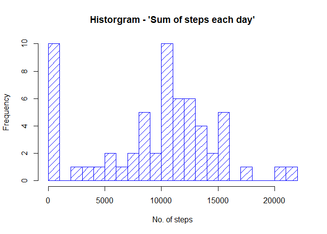
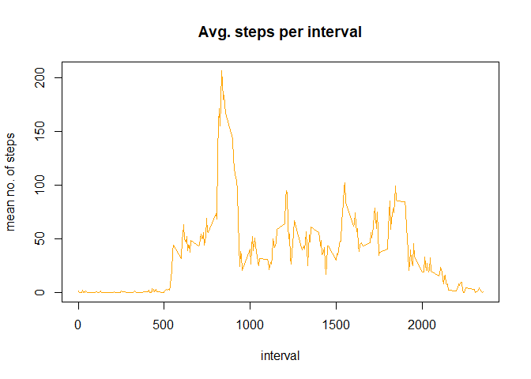
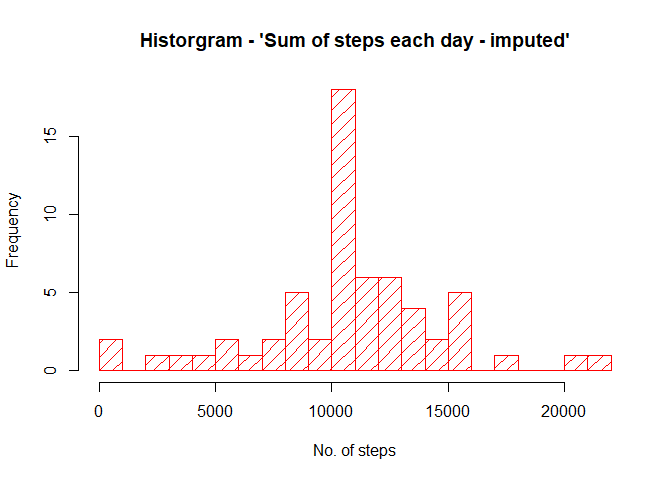

Reproducible Research(Assignment 1)
===================================

Brief introduction
------------------

This is an R Markdown document is created towards submission of
assignment - 1 for Reproducible Research. Each of the subsection will
answer the questions asked as part of the assignment.

Loading and preprocessing the data
----------------------------------

Doing a check of the *repdata\_data\_activity.csv* file tells, that...

1.  Steps are numeric, with NA value's.
2.  Date in format YYYY-MM-DD".
3.  *interval* as numeric value.

Let us define classes for these columns, so the import would be in
predefine format.

    setClass("dtClass")
    setAs("character","dtClass", function(from) as.POSIXct(from, format="%Y-%m-%d")) 
    coltypes<-c("numeric","dtClass","numeric")

Now we can do the actual import. Note, we have defined date column as
`dtClass` as defined above. The file is picked up from
*repdata\_data\_activity.csv*

    activity <- read.csv("repdata_data_activity\\activity.csv", header = TRUE, colClasses = coltypes)

Quick check on the data that is imported...

    summary(activity)

    ##      steps             date               interval     
    ##  Min.   :  0.00   Min.   :2012-10-01   Min.   :   0.0  
    ##  1st Qu.:  0.00   1st Qu.:2012-10-16   1st Qu.: 588.8  
    ##  Median :  0.00   Median :2012-10-31   Median :1177.5  
    ##  Mean   : 37.38   Mean   :2012-10-31   Mean   :1177.5  
    ##  3rd Qu.: 12.00   3rd Qu.:2012-11-15   3rd Qu.:1766.2  
    ##  Max.   :806.00   Max.   :2012-11-30   Max.   :2355.0  
    ##  NA's   :2304

What is mean total number of steps taken per day?
-------------------------------------------------

### 1. Calculate the total number of steps taken per day

To do this, we shall use the `tapply` function.

    sumDSteps<-tapply(activity$steps, activity$date, sum, na.rm=TRUE)

Let us print this variable to answer our question

    sumDSteps

    ## 2012-10-01 2012-10-02 2012-10-03 2012-10-04 2012-10-05 2012-10-06 2012-10-07 
    ##          0        126      11352      12116      13294      15420      11015 
    ## 2012-10-08 2012-10-09 2012-10-10 2012-10-11 2012-10-12 2012-10-13 2012-10-14 
    ##          0      12811       9900      10304      17382      12426      15098 
    ## 2012-10-15 2012-10-16 2012-10-17 2012-10-18 2012-10-19 2012-10-20 2012-10-21 
    ##      10139      15084      13452      10056      11829      10395       8821 
    ## 2012-10-22 2012-10-23 2012-10-24 2012-10-25 2012-10-26 2012-10-27 2012-10-28 
    ##      13460       8918       8355       2492       6778      10119      11458 
    ## 2012-10-29 2012-10-30 2012-10-31 2012-11-01 2012-11-02 2012-11-03 2012-11-04 
    ##       5018       9819      15414          0      10600      10571          0 
    ## 2012-11-05 2012-11-06 2012-11-07 2012-11-08 2012-11-09 2012-11-10 2012-11-11 
    ##      10439       8334      12883       3219          0          0      12608 
    ## 2012-11-12 2012-11-13 2012-11-14 2012-11-15 2012-11-16 2012-11-17 2012-11-18 
    ##      10765       7336          0         41       5441      14339      15110 
    ## 2012-11-19 2012-11-20 2012-11-21 2012-11-22 2012-11-23 2012-11-24 2012-11-25 
    ##       8841       4472      12787      20427      21194      14478      11834 
    ## 2012-11-26 2012-11-27 2012-11-28 2012-11-29 2012-11-30 
    ##      11162      13646      10183       7047          0

### 2. If you do not understand the difference between a histogram and a barplot, research the difference between them. Make a histogram of the total number of steps taken each day

Following is the difference between barplot and histogram...

-   Histogram
    -   Used to show distribution of variables.
    -   Used with quantitative data, often distributed in 'bins'.
-   Barplot
    -   Used to compare variables.
    -   Used with Categorical data (as referred to as *Factor* in *R*).

<!-- -->

    hist(sumDSteps, breaks=22, col = "blue", density = 10, xlab="No. of steps", ylab="Frequency", main="Historgram - 'Sum of steps each day'")

### 3. Calculate and report the mean and median of the total number of steps taken per day

Having done the above, the mean and median can be done by simple
commands `mean` and `median` respectively.

    meanTotSteps <- mean(sumDSteps)
    meanTotSteps

    ## [1] 9354.23

    medianTotSteps <- median(sumDSteps)
    medianTotSteps

    ## [1] 10395

What is the average daily activity pattern?
-------------------------------------------

### 1.Make a time series plot (type = "l") of the 5-minute interval (x-axis) and the average number of steps taken, averaged across all days (y-axis)

We shall again deply `tapply` function to calculate and display it using
`plot` with `type=l`

    intMeanSteps<-tapply(activity$steps,activity$interval,mean,na.rm=TRUE)
    plot(names(intMeanSteps), intMeanSteps, type="l", xlab="interval", ylab="mean no. of steps", main="Avg. steps per interval", col="orange")

### 2.Which 5-minute interval, on average across all the days in the dataset, contains the maximum number of steps?

To answer this, let us order the means result in an descending order.

    intMaxOrder<- intMeanSteps[order(-as.numeric(intMeanSteps))]

So to get the highest 5 minutes interval, we simply get the name of the
first element in `intMaxOrder`

    names(intMaxOrder[1])

    ## [1] "835"

Imputing missing values
-----------------------

### 1. Calculate and report the total number of missing values in the dataset (i.e. the total number of rows with NAs)

We shall use the `is.na` and `sum` command to get the NA and then add
them up.

    sum(is.na(activity$steps))

    ## [1] 2304

### 2. Devise a strategy for filling in all of the missing values in the dataset. The strategy does not need to be sophisticated. For example, you could use the mean/median for that day, or the mean for that 5-minute interval, etc.

**Strategy for imputing:** We shall replace the NA values with the mean
value of that interval.

Below are the steps followed.

1.  Get all the means per interval

<!-- -->

    intMeans <- tapply(activity$steps, activity$interval, mean, na.rm=TRUE)

### 3. Create a new dataset that is equal to the original dataset but with the missing data filled in.

1.  Create a new variable to handle it

<!-- -->

    actProcessed <- activity

1.  Get all the intervals, where there is a NA

<!-- -->

    missedInteval <- as.character(actProcessed[is.na(actProcessed$steps), "interval"])

1.  Now we take the corresponding mean value from the earlier calculated
    list and replace NA with it.

<!-- -->

    actProcessed[is.na(actProcessed$steps), "steps"] <- intMeans[missedInteval]

A quick check...

    sum(is.na(actProcessed$steps))

    ## [1] 0

### 4. Make a histogram of the total number of steps taken each day and Calculate and report the mean and median total number of steps taken per day. Do these values differ from the estimates from the first part of the assignment? What is the impact of imputing missing data on the estimates of the total daily number of steps?

Like above, we shall use `tapply` for this calculation...

    sumDStepsMod<-tapply(actProcessed$steps, actProcessed$date, sum)
    hist(sumDStepsMod, breaks=22, col = "red", density = 10, xlab="No. of steps", ylab="Frequency", main="Historgram - 'Sum of steps each day - imputed'")

**Impact of imputing:**  
Let us print the mean and medians, before and after imputing to see the
impact

1.  Effect of imputing on mean

<!-- -->

    ## [1] "Before : 9354.23 , After :  10766.19"

1.  Effect of imputing on median

<!-- -->

    ## [1] "Before : 10395 , After :  10766.19"

Are there differences in activity patterns between weekdays and weekends?
-------------------------------------------------------------------------

### 1.Create a new factor variable in the dataset with two levels - "weekday" and "weekend" indicating whether a given date is a weekday or weekend day.

We shall use `sapply` function to convert date to a factor and assign it
to a new column in our modified dataset \`actProcessed'. An anonymous
function will be used to chek the value of weekday and map it back to
either a weekday or weekend.

    wkDays <- c("Monday","Tuesday","Wednesday","Thursday","Friday")
    actProcessed$typeOfDay <- factor(sapply(actProcessed$date,function(x){if (weekdays(x)%in%wkDays)"weekday"else"weekend"}))

### 2. Make a panel plot containing a time series plot of the 5-minute interval (x-axis) and the average number of steps taken, averaged across all weekday days or weekend days (y-axis). See the README file in the GitHub repository to see an example of what this plot should look like using simulated data.

1.  Let us first do the calculations required for rendering in plot. Use
    `tapply` and \`mean'

<!-- -->

    temp <-
      tapply(
        actProcessed$steps,
        list(actProcessed$interval, actProcessed$typeOfDay),
        mean,
        na.rm = TRUE
      )

1.  We shall now populate it in a data frame for rendering

<!-- -->

    tempDF <-
      data.frame(
        inteval <- c(
          rep(as.numeric(rownames(temp)), 2)),
          typeOfDay <-
            c(as.character(rep("weekend", length(rownames(
              temp
            )))), as.character(rep("weekday", length(rownames(
              temp
            ))))),
          meanSteps <- c(temp[, "weekend"], temp[, "weekday"]))
    colnames(tempDF)<- c("interval","typeOfDay","MeanSteps") 

1.  Finally, we do the plot. The figure in README indicate it is XYPLOT.
    We shall thus import the `lattice` package and then render our plot.

<!-- -->

    library(lattice)
    xyplot(MeanSteps~interval|typeOfDay, data = tempDF, layout=c(1,2), type="l")

End
===
